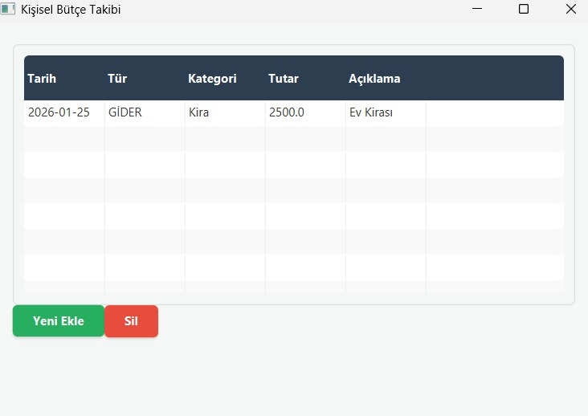

# 💰 Personal Budget Tracker

**Developer:** Muhammed Ali Sümbül

A modern, lightweight desktop application designed to track personal finances. Built with the latest **Java 24** features and **JavaFX**, this application allows users to manage income and expenses with a persistent **SQLite** database backend.


*(Note: Please add a 'screenshot.png' file to the root directory to display the preview)*

---

## 🚀 Key Features

* **Persistent Storage:** Uses **SQLite** to store data locally, ensuring your financial records are safe and accessible even after restarting the app.
* **Modern Architecture:** Implements the **MVC (Model-View-Controller)** design pattern for clean and maintainable code.
* **Java Records:** Utilizes modern Java 16+ **Record** types for immutable and concise data modeling.
* **Custom UI:** A polished user interface styled with custom **CSS** for a modern look and feel.
* **Full CRUD Operations:**
    * ✅ **Create:** Add new income or expense records with dates and categories.
    * ✅ **Read:** View all transactions in a dynamic, styled table.
    * ✅ **Delete:** Remove unwanted records instantly from the database.

## 🛠️ Tech Stack

This project showcases the use of cutting-edge Java technologies:

* **Language:** Java 24 (JDK 24 - Early Access)
* **UI Framework:** JavaFX 23
* **Database:** SQLite (via JDBC)
* **Build Tool:** Maven
* **Design Pattern:** MVC

💻 Installation & Usage

To run this project on your local machine:

Clone the repository:


git clone [https://github.com/yourusername/BudgetTracker.git](https://github.com/yourusername/BudgetTracker.git)

Open in IntelliJ IDEA: Open the project folder and let Maven download the necessary dependencies.

Run the Application: Execute the Main.java file.

⚠️ Important Note for Java 24: Since this project runs on Java 24 (Early Access), you might need to add the following VM Options in your run configuration to avoid access warnings:


--enable-native-access=ALL-UNNAMED

## 📂 Project Structure

```text
src/main/java/org/budgettracker/
├── controller/       # UI Logic & Event Handling
│   ├── DashboardController.java
│   └── AddTransactionController.java
├── dao/              # Data Access Objects (Database Layer)
│   ├── DBConnection.java
│   └── TransactionDAO.java
├── model/            # Data Models (Java Records)
│   └── Transaction.java
└── Main.java         # Application Entry Point
```
📜 License
This project is open-source and available for personal and educational use.

© 2025 Muhammed Ali Sümbül


